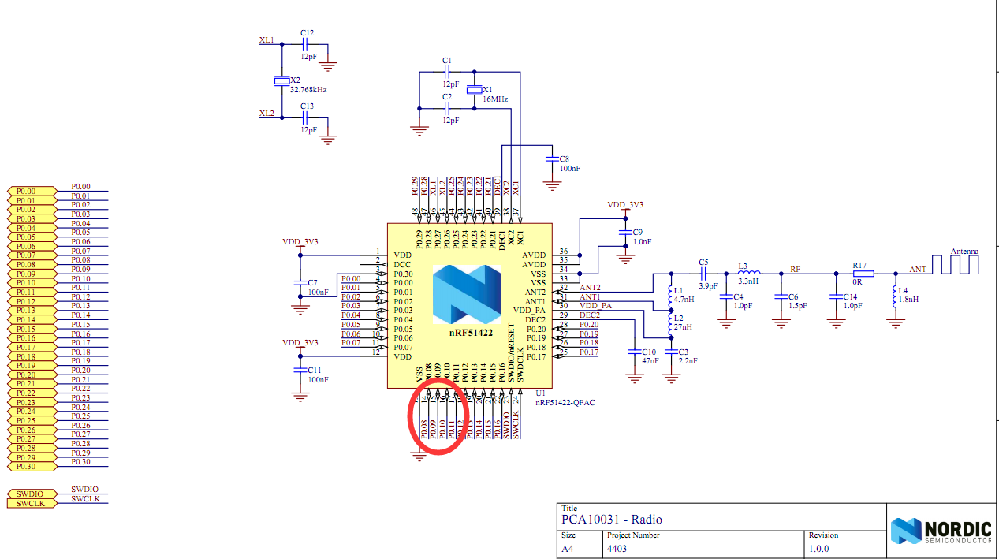
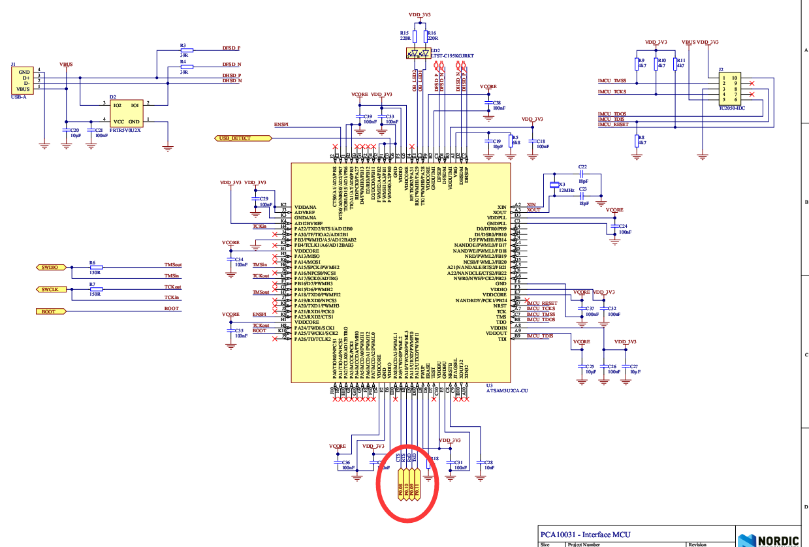
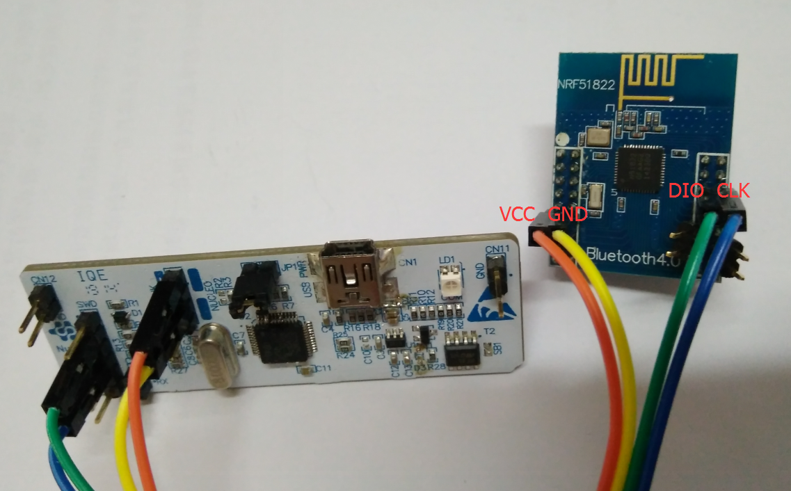
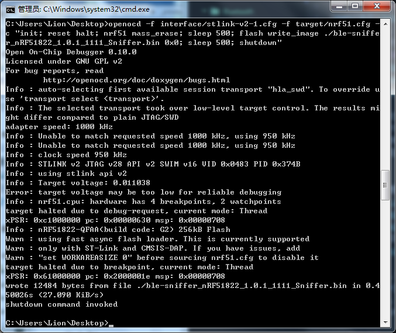
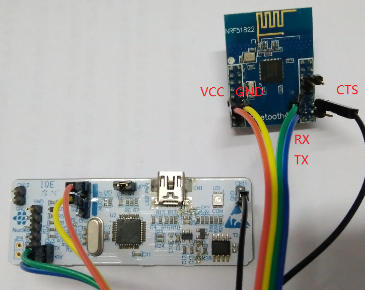
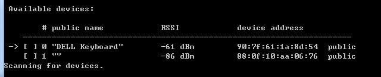
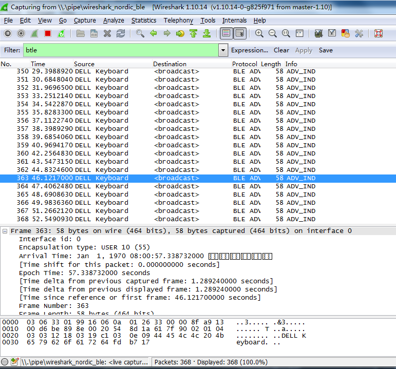

### 为什么要DIY抓包器
[KW41Z活动](http://www.eeworld.com.cn/huodong/201611_NXPKW41ZActivity1/index.html) 正搞得如火如荼，大量小伙伴即将拿到FRDM-KW41Z开发套件，不过貌似这次活动不提供USB-KW41Z，抓包器类似于逻辑分析仪，当你要用它时，往往能起到事半功倍的作用。
*关于USB-KW41Z的细节，可以看官方教程 [Get Started with USB-KW41Z](http://www.nxp.com/products/microcontrollers-and-processors/more-processors/application-specific-mcus-mpus/bluetooth-low-energy-ble/bluetooth-low-energy-ieee-802.15.4-packet-sniffer-usb-dongle:USB-KW41Z?tab=In-Depth_Tab)*
<!-- more -->
据我所知，目前比较火的BLE廉价抓包方案有nRF51822和CC2540，51822主要配合wireshark使用，CC2540要配合TI软件，功能有一定差异，二者淘宝上都有卖，几十块钱（寨版）。因为我手上还有两块nRF51822的模块，就想着把这个模块改成Sniffer，毕竟凡人皆可山寨。有钱人就不用往下看了，下面的事情都可以花钱搞定。

### 评估
先翻下官方的原理图，[nRF51 Dongle](https://www.nordicsemi.com/eng/Products/nRF51-Dongle/) 是这个样子的：

第二个芯片只是实现USB转USART的功能，看来硬件很容易处理。[PDF原理图下载](PCA10031_Schematic_And_PCB.pdf)

下面是软件部分，官方提供了PC软件和MCU执行文件[nRF-Sniffer](https://www.nordicsemi.com/eng/nordic/download_resource/38647/15/59410351/39099)，在Firmware文件夹下有一个`ble-sniffer_nRF51822_1.0.1_1111_Sniffer.hex`文件。想必是sniffer的固件了。

### 硬件准备
网上搜了下，可以用ST-Link V2-1 + Openocd的办法搞定，按下图连好：
 *此图在ST-Link端连接有错误，不过标注是正确的*

### 固件烧写
先将Hex文件转为bin，在bin文件所在目录下,一条命令完成烧写：
`openocd -f interface/stlink-v2-1.cfg -f target/nrf51.cfg -c "init; reset halt; nrf51 mass_erase; sleep 500; flash write_image ./ble-sniffer_nRF51822_1.0.1_1111_Sniffer.bin 0x0; sleep 500; shutdown"`

### 开始蓝牙抓包
ST-LinkV2-1上没有流控口，所以我先把模块上的CTS强制拉低，先测试下把

打开`ble-sniffer_win_1.0.1_1111_Sniffer.exe`，果然能扫到我的蓝牙键盘

按数字键选择该设备，按下w，即可启动Wireshark。*关于Wireshark，建议使用1.10.14 [x64下载地址](https://www.wireshark.org/download/win64/all-versions/Wireshark-win64-1.10.14.exe) 最新版本有问题，其他版本不清楚*

### 后续
要去买一个支持流控的USB串口工具，另外期望USB-KW41Z也可以这样DIY出来，毕竟比nRF51822强大多了。

### 参考
1. http://www.weixinnu.com/tag/article/2927537612
2. https://devzone.nordicsemi.com/question/79845/nrf-sniffer-support-for-wireshark-v203/
3. https://devzone.nordicsemi.com/question/14761/programming-nrf51822-using-swd/
