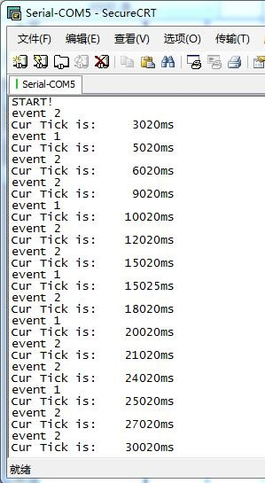

初次接触非对称双核MCU，由于之前好多知识不熟悉，这三天遇到不少问题。现在终于把事件驱动在M0核上跑起来了，就发一贴简单介绍下这个事件驱动构架和这几天的5410x芯片学习所得。
关于事件驱动架构，其主要用于低功耗设计，可以很方便的进入休眠模式。一般单片机裸奔都是轮询，如：
```c
void main()
{
    while(1)
    {
        tesk1();
        tesk2();
        tesk3();
    }
}
```
在这种轮询处理中，很难判断在何时休眠，该休眠多长时间，又该使用什么等级的休眠。

而事件驱动的main函数如下（以VSF为例）：
```c
while (1)
{
    vsfsm_poll();
    vsf_enter_critical();
    if (!vsfsm_get_event_pending())
    {
        vsf_leave_critical();
        __WFI();
    }
    else
    {
        vsf_leave_critical();
    }
}
```
VSF在程序中增加了一个事件队列，当这个事件队列为空时，即进行休眠。休眠时间由程序所配置的唤醒定时器决定，当然一些外部硬件中断也可以唤醒。如果需要使用不同的休眠等级，那也需要做一个休眠等级管理器，不同线程要求不同的休眠等级，然后由管理器决定休眠等级。当然这些细化配置会比较麻烦。

其实，事件驱动能干的，在RTOS中都能干，很多事情RTOS可以干的更好，更舒服。但是，事件驱动有一个最大的优点：省RAM，在很多低功耗MCU中，RAM一般比较小，RTOS虽然都能裁剪，但是每个任务所分配的堆栈不能裁剪，当任务一多，ram分配也挺烦心。而事件驱动归根到底还是裸奔，只是将线程（一个函数指针加一个事件状态）放在队列中进行管理，逐个调用而已。每个线程只花费十几个字节RAM。

这次所用的是Simon的事件驱动VSF平台，代码是放在github上的，github.com/versaloon/vsf，21ic也有一些介绍帖，有兴趣自己去看。
下面把示例代码献丑一下，非常非常粗糙的，帖子里的代码额外增加了中文说明。
```c
// 线程1
// 定义一个事件状态
#define EVENT_1_USER_LOCAL_SCANF                (VSFSM_EVT_USER_LOCAL + 1)
static struct vsfsm_state_t *
event_1_handler(struct vsfsm_t *sm, vsfsm_evt_t evt);
struct vsfsm_t event_1_sm =
{
        {event_1_handler}, // 初始化handler
};
// 用于产生间隔为5秒的周期事件定时器
static struct vsftimer_timer_t event_1_timer =
{
        5000,        // 间隔为5秒
        &event_1_sm,        // 对应状态机
        EVENT_1_USER_LOCAL_SCANF, // 周期事件
};
struct vsfsm_state_t *
event_1_handler(struct vsfsm_t *sm, vsfsm_evt_t evt)
{
        switch (evt)
        {
        case VSFSM_EVT_INIT: // 初始化事件时，被默认执行
                vsftimer_register(&event_1_timer);
                break;
        case EVENT_1_USER_LOCAL_SCANF: // 周期事件处理
                Board_UARTPutSTR(“event 1rn”); // 打印出“event 1”
                print_tick();                                        // 打印出当前系统tick
                break;
        default:
                break;
        }
        return NULL;
}
// 线程2，将线程间隔改为3秒
#define EVENT_2_USER_LOCAL_SCANF                (VSFSM_EVT_USER_LOCAL + 1)
static struct vsfsm_state_t *
event_2_handler(struct vsfsm_t *sm, vsfsm_evt_t evt);
struct vsfsm_t event_2_sm =
{
        {event_2_handler},
};
static struct vsftimer_timer_t event_2_timer =
{
        3000,
        &event_2_sm,
        EVENT_2_USER_LOCAL_SCANF,
};
struct vsfsm_state_t *
event_2_handler(struct vsfsm_t *sm, vsfsm_evt_t evt)
{
        switch (evt)
        {
        case VSFSM_EVT_INIT:
                vsftimer_register(&event_2_timer);
                break;
        case EVENT_2_USER_LOCAL_SCANF:
                Board_UARTPutSTR(“event 2rn”);
                print_tick();
                break;
        default:
                break;
        }
        return NULL;
}
int main(void)
{
        // 串口初始化
        board_uart_init();
        // 使用utick中断唤醒
        board_utick_init();
        vsftimer_init();
        Board_UARTPutSTR(“START!rn”);
        vsfsm_init(&event_1_sm);
        vsfsm_init(&event_2_sm);
        vsf_leave_critical();
        while (1)
        {
                vsfsm_poll(); // 轮询状态机
                vsf_enter_critical();
                if (!vsfsm_get_event_pending()) // 判断是否有未处理事件
                {
                        vsf_leave_critical();
                        __WFI();
                }
                else
                {
                        vsf_leave_critical();
                }
        }
}
```

串口输出：



PS: 现在的vsftimer并没有做休眠时间的动态管理，而是简单粗暴的定时唤醒一次，看看有没有事件需要处理。这个功能我会在后面完善。
Simon的架构中还有很多好玩的东西，有兴趣可以去研究下。
