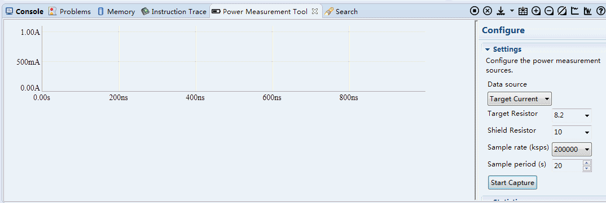
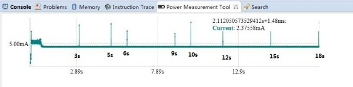

在之前的例子中，软件定时器的驱动源来自于周期固定为1mS的硬件中断。在中断中，回调软件定时器的驱动函数，产生一个软件定时器的"VSFSM_EVT_TIMER"事件，然后退出中断。事件驱动会调用轮询软件定时器的handler，执行"VSFSM_EVT_TIMER"事件，如下：
```c
// vsftimer_callback_int is called in interrupt,
// simply send event to vsftimer SM
void vsftimer_callback_int(void)
{
        vsfsm_post_evt_pending(&vsftimer.sm, VSFSM_EVT_TIMER);
}

static struct vsfsm_state_t *
vsftimer_init_handler(struct vsfsm_t *sm, vsfsm_evt_t evt)
{
        switch (evt)
        {
        case VSFSM_EVT_TIMER:
        {
                uint32_t cur_tickcnt = core_interfaces.tickclk.get_count();
                struct vsftimer_timer_t timer, *ptimer = vsftimer.timerlist;

                while (ptimer != NULL)
                {
                        // save timer on stack in case event handler of the state machine
                        // unregister and free the timer, beause timer on stack maintain
                        // the list pointing to the next timer
                        timer = *ptimer;
                        if ((cur_tickcnt - timer.start_tickcnt) >= timer.interval)
                        {
                                // triggered
                                ptimer->start_tickcnt = cur_tickcnt;
                                if ((timer.sm != NULL) && (timer.evt != VSFSM_EVT_INVALID))
                                {
                                        vsfsm_post_evt(timer.sm, timer.evt);
                                }
                        }
                        ptimer = sllist_get_container(timer.list.next,
                                                                                        struct vsftimer_timer_t, list);
                }
                return NULL;
        }
        default:
                return NULL;
        }
}
```
在"case VSFSM_EVT_TIMER"中，会遍历vsftimer.timerlist列表中所有timer，比较它们是否超时，如果超时，便会产生该定时器期望的超时事件。

为了实现动态休眠，确保每次唤醒都是有效唤醒，需要在执行__wfi()前，找到定时器列表中会最快发生的超时定时器并获得其触发超时所需的时间，然后将该时间设置为硬件定时器触发时间即可。一个简单的处理方法是将软件定时器根据触发时间排序，代码如下：
定时器的插入处理：
```c
static void insert_timer(struct vsftimer_timer_t *timer)
{
        struct vsftimer_timer_t *ptimer, *ntimer;

        sllist_init_node(timer->list);

        if (NULL == vsftimer.timerlist)
        {
                vsftimer.timerlist = timer;
                return;
        }

        if (vsftimer.timerlist->trigger_tick > timer->trigger_tick)
        {
                sllist_insert(timer->list, vsftimer.timerlist->list);
                vsftimer.timerlist = timer;
                return;
        }

        ptimer = vsftimer.timerlist;
        ntimer = sllist_get_container(ptimer->list.next, struct vsftimer_timer_t,
                                                                        list);
        while (ntimer != NULL)
        {
                if (ntimer->trigger_tick > timer->trigger_tick)
                {
                        break;
                }
                ptimer = ntimer;
                ntimer = sllist_get_container(ptimer->list.next,
                                                                                struct vsftimer_timer_t, list);
        }

        if (ntimer != NULL)
        {
                sllist_insert(timer->list, ntimer->list);
        }
        sllist_insert(ptimer->list, timer->list);
}
```
"VSFSM_EVT_TIMER"事件的处理：
```c
static struct vsfsm_state_t *
vsftimer_init_handler(struct vsfsm_t *sm, vsfsm_evt_t evt)
{
        switch (evt)
        {
        case VSFSM_EVT_TIMER:
        {
                uint32_t cur_tick = get_system_tick();
                struct vsftimer_timer_t *timer = vsftimer.timerlist;

                while (timer != NULL)
                {
                        if (cur_tick >= timer->trigger_tick)
                        {
                                // triggered
                                timer->trigger_tick += timer->interval;
                                vsftimer_unregister(timer);
                                if (timer->trigger_cnt > 0)
                                {
                                        timer->trigger_cnt--;
                                }
                                if (timer->trigger_cnt != 0)
                                {
                                        insert_timer(timer);
                                }
#if VSFSM_CFG_DELAY_EN
                                else
                                {
                                        timer->malloced = 0;
                                }
#endif
                                if ((timer->sm != NULL) && (timer->evt != VSFSM_EVT_INVALID))
                                {
                                        vsfsm_post_evt(timer->sm, timer->evt);
                                }
                                timer = vsftimer.timerlist;
                                continue;
                        }
                        else
                        {
                                break;
                        }
                }
                return NULL;
        }
        default:
                return NULL;
        }
}
```
硬件中断，及硬件定时器间隔设置函数：
```c
static uint32_t system_tick = 0;
uint32_t get_system_tick(void)
{
        return system_tick;
}
void CT32B0_IRQHandler(void)
{
        if (Chip_TIMER_MatchPending(LPC_TIMER0, 1))
        {
                Chip_TIMER_ClearMatch(LPC_TIMER0, 1);
                system_tick += LPC_TIMER0->MR[1] / (Chip_Clock_GetAsyncSyscon_ClockRate() / 1000);
                Chip_TIMER_SetMatch(LPC_TIMER0, 1, (Chip_Clock_GetAsyncSyscon_ClockRate() / 1000));
                vsftimer_callback_int();
        }
}
void wfi_handle(void)
{
        __WFI();
}
void timer0_set_interval(uint32_t ms)
{
        uint32_t temp = LPC_TIMER0->MR[1] / (Chip_Clock_GetAsyncSyscon_ClockRate() / 1000);
        if (ms > temp)
        {
                Chip_TIMER_Disable(LPC_TIMER0);
                Chip_TIMER_SetMatch(LPC_TIMER0, 1, ((Chip_Clock_GetAsyncSyscon_ClockRate() / 1000) * ms));
                Chip_TIMER_Enable(LPC_TIMER0);
        }
}
```
执行__wfi前，休眠时间的计算：
```c
vsf_err_t vsftimer_wfi(void)
{
        if ((vsftimer_wakeup_interval_set_handle == NULL) ||
                (vsftimer_wfi_handle == NULL))
        {
                return VSFERR_FAIL;
        }

        if(vsftimer.timerlist == NULL)
        {
                (*vsftimer_wakeup_interval_set_handle)(0xffff);
        }
        else
        {
                uint32_t cur_tick = get_system_tick();
                if (vsftimer.timerlist->trigger_tick > cur_tick)
                {
                        (*vsftimer_wakeup_interval_set_handle)(vsftimer.timerlist->trigger_tick - cur_tick);
                }
                else
                {
                        return VSFERR_NOT_READY;
                }
        }
        (*vsftimer_wfi_handle)();
        return VSFERR_NONE;
}
```
最后，无图无真相，看看效果吧。

上电后20s的功耗曲线：



最终曲线静态图：



对比下串口输出，是不是一致的呢？
```
START!
event 2
Cur Tick is:     3000ms
event 1
Cur Tick is:     5000ms
event 2
Cur Tick is:     6000ms
event 2
Cur Tick is:     9000ms
event 1
Cur Tick is:    10000ms
event 2
Cur Tick is:    12000ms
event 1
Cur Tick is:    15000ms
event 2
Cur Tick is:    15002ms
event 2
Cur Tick is:    18000ms
```
