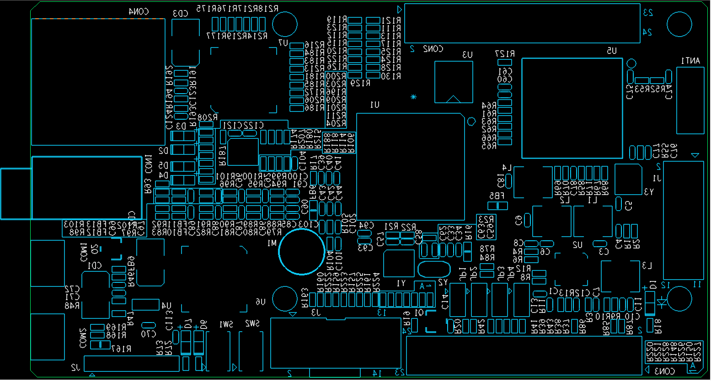
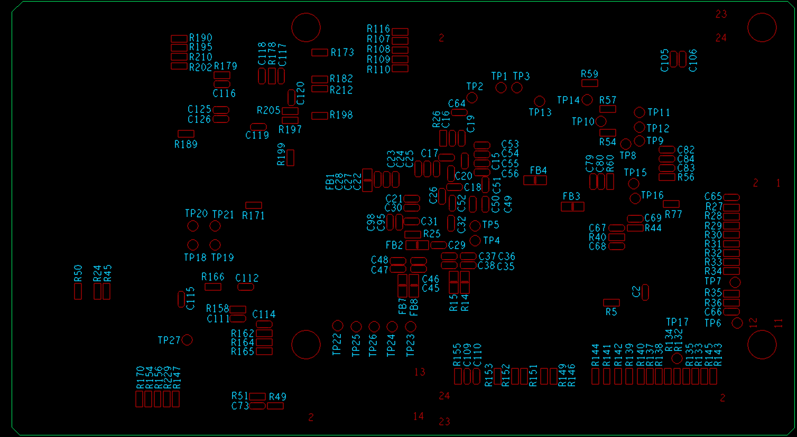

## [原理图(点击下载)](x1000_board_20160220_2000.pdf)

## 丝印图：

## 此板子在工厂并未进行出厂测试，所以新板到手后，建议依照如下步骤进行测试：
#### 1.使用万用表确认USB5V输入、L1-L4四个电感与地之间无短路
#### 2.使用Micor USB线连接COM2，给开发板上电，D1，D3，D5会亮起
#### 3.将jp1-jp4四组跳线焊好，并使用跳线帽短接jp2及jp4，然后同时将com1及com2接上电脑（com2用于供电，com1用于usb连接）。此时，电脑端应该会发现一个新设备，之后可按照君正提供的烧录文档进行操作
#### 4.烧写君正官方固件后，需要将jp2及jp4都断开，并复位，linux方能正常启动
#### 5.其他部分本人未测试
