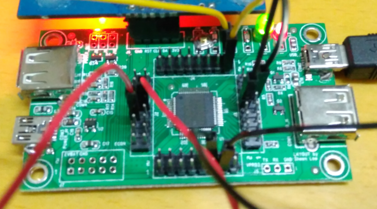
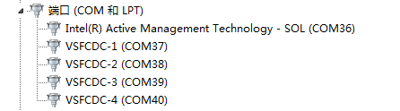
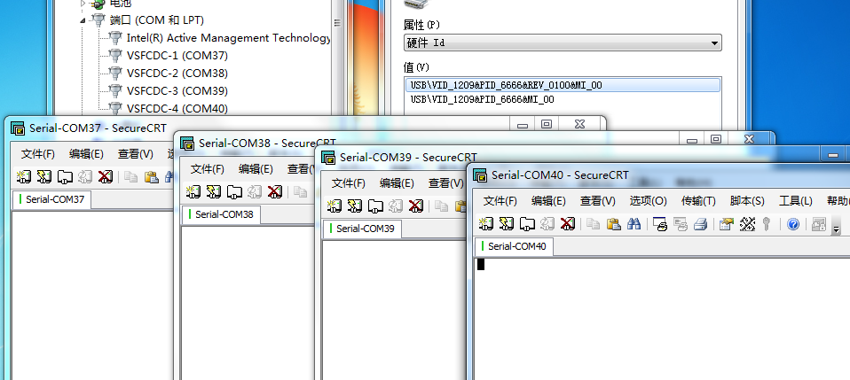
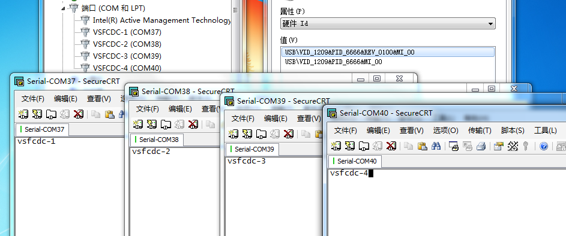

一段时间前在坛子里看到帖子[怒滴UART HUB](http://bbs.eeworld.com.cn/forum.php?mod=viewthread&tid=521417),当时就有了搞USB单芯片多CDC串口的想法。无奈本人拖延症严重，平时用用ST-Link/V2-1上的串口就很舒服了，完全没有自己捣鼓CDC的动力，念头一转，就放下了。
<!-- more -->
今天，本是计划开搞CloudLoader（MCU上的开源OTA Bootloader方案），由于这个东西也用到一个CDC串口，工程搭好后，又想起这个4路串口的事情，索性就花点时间先搞定它了。
过程非常简单，单片机开发都是套路，这种单串口改4串口，基本上就是把1个实例做成4个实例就行了，然后测试，期间，因为一个疏忽，浪费了45分钟。最终结果当然Ok啦，闲话少说，上图：

###### 这是NUC400的硬件，已将4个物理串口短接

###### 连电脑，打驱动后

###### 打开4个串口

###### 输入字符串，实时回显

这玩意有啥用呢？应该没啥用，我还是继续用ST-Link/V2-1好啦。不过，还是顺带说下软硬件的细节，要是有人感兴趣的话。
1. 硬件上使用了NUC400 LQFP64，有4个物理串口
2. NUC400有2+12个物理端点，且能配置为9个逻辑端点，这点很重要，刚好满足本应用的需要
3. 倘若有童鞋要用其他硬件实现，比如STM32或NUC505，应该是比较简单的，驱动现成[Link](https://github.com/talpachen/vsf/tree/CloudLoader/vsf/interfaces/cpu),不过应该做不到4路
4. 工程源码，要用IAR7.4编译[Link](https://github.com/talpachen/vsf/tree/CloudLoader/vsf/example/4Port-USBCDC)
5. Win10免驱，Win7需要的驱动也在工程目录下
