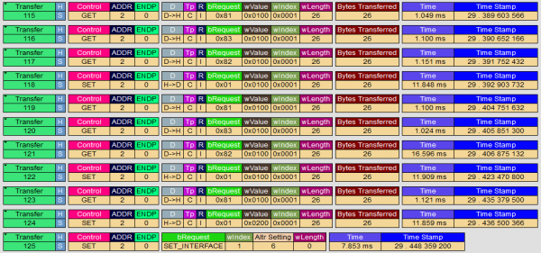
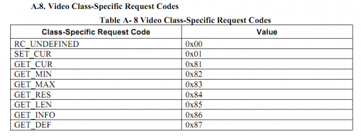
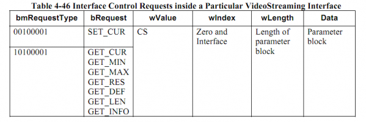
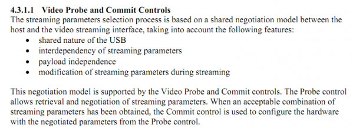
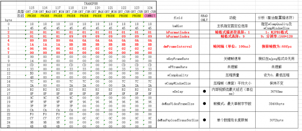

计划在单片机（主要是Cortex-M系列）上驱动USB UVC摄像头，本帖是对Windows下枚举过程的分析。

摄像头插入后的枚举，一开始由usbh core来负责，此过程与其他类设备相同，不再赘述。
UVC类驱动主要负责获得摄像头状态，根据要求设置摄像头参数以及获得数据。

在win7系统上，当应用有读取摄像头的请求是，类驱动便按照一定流程开始操作，我的目的便是按照这一流程在单片机上激活特定摄像头并获得数据。（UVC标准类驱动太过复杂，暂无搞通用驱动的必要）

## 传输类型总览：

其中bRequest意义参考此表：

整个流程中使用了GET_CUR,GET_MIN,GET_MAX以及SET_CUR四种请求。

## Transfer分析：

在上图所有transfer中wIndex都是0x0001，即指定了entity0及interface1。由配置描述符可知interface1为VideoStreaming，所以根据下表分析：

bRequest中缩写的意义：
>* Current setting attribute (GET_CUR)
>* Minimum setting attribute (GET_MIN)
>* Maximum setting attribute (GET_MAX)
>* Default setting attribute (GET_DEF)
>* Resolution attribute (GET_RES)
>* Data length attribute (GET_LEN)
>* Information attribute (GET_INFO)

wValue是选择控制器，除一个0x0200外，都是0x0100，意义如下
>* VS_CONTROL_UNDEFINED 0x00
>* VS_PROBE_CONTROL 0x01
>* VS_COMMIT_CONTROL 0x02
>* VS_STILL_PROBE_CONTROL 0x03
>* VS_STILL_COMMIT_CONTROL 0x04
>* VS_STILL_IMAGE_TRIGGER_CONTROL 0x05
>* VS_STREAM_ERROR_CODE_CONTROL 0x06
>* VS_GENERATE_KEY_FRAME_CONTROL 0x07
>* VS_UPDATE_FRAME_SEGMENT_CONTROL 0x08
>* VS_SYNCH_DELAY_CONTROL 0x09

wLength指定附件参数长度，都是26

这样分析后，就可以清楚的看到，系统对视频流接口的参数进行了probe和commit两种操作，先通过probe进行参数协商，最后commit激活。也可以看下协议中对这个过程的描述：

关于data中26字节数据的分析，请看下表，如果表格显示不完整，请看附件。

在在协商完成后，设置interface altr setting，随后启动同步传输，开始搬运数据。
至此，针对D881HD720P摄像头的枚举分析完毕。
