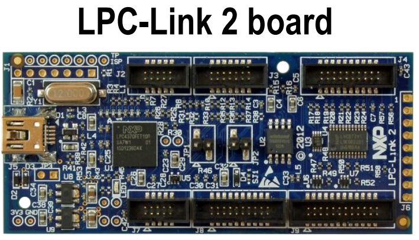

# 硬件简单介绍
NXP官方有一块LabTool扩展板，同样是配合LPC-Link2使用的，可惜价格感人，近1k人民币。这块自制板子成本控制在100以内，相比LabTool少了函数发生器的功能，其他没什么差别。
<!-- more -->
# 启动模式

1. JP1短接时，单片机从SPI Flash启动
2. JP1断开时，单片机从USBD启动，就是一个DFU USB设备，可以用“LPC-Link 2 Configuration Tool”工具刷写固件

# 计算力资源
LPC4370内部有三个ARM核，一个Cortex-M4 + 两个Cortex-M0。在计算力分配上，还是需要实现约定好。
- M4：主力计算
- M0APP：外设控制
- M0SUB：SGPIO控制

# 涉及外设
- SGPIO
- USART2
- USBD
- SPIFI
- ADCHS

# 存储资源(LPC4370)
TYPE         | ADDR       | SIZE   | FUNCTION
---          | ---        | ---    | ---
Local SRAM   | 0x10000000 | 128kB  | M4 data
Local SRAM   | 0x10080000 | 72kB   | M4 code
M0SUB SRAM   | 0x18000000 | 16+2kB | M0SUB
AHB SRAM     | 0x20000000 | 32kB   | M0APP
AHB SRAM     | 0x20008000 | 16kB   | M0APP
AHB/ETB SRAM | 0x2000c000 | 16kB   | M0APP
SPIFI        | 0x14000000 | 64MB   | STORAGE

注意：SPIFI是外接的SPI FLASH，实际容量是1MB

# 时钟配置
TYPE         | CLK       
---          | ---        
HXT          | 12 000 000
PLL0_USB     | 480 000 000
PLL1         | 204 000 000
M4           | PLL1
MOSUB        | PLL0_USB/2
SGPIO        | PLL0_USB/2
SPI          | PLL0_USB/2
USB          | PLL0_USB
USART2       | PLL0_USB/4
